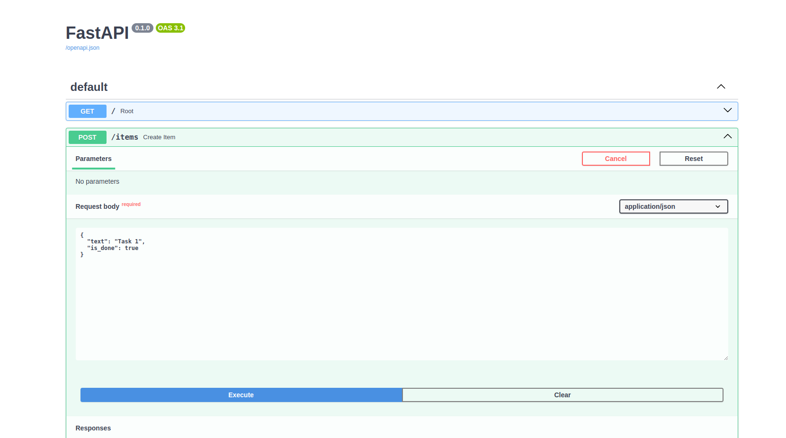

# 📌 FastAPI Todo API

This is a simple Todo API project built using FastAPI.

## 🚀 Installation

Follow these commands to set up the project:

```sh
# 1. Create and activate a virtual environment
python -m venv env
source env/bin/activate  # For MacOS/Linux
env\Scripts\activate    # For Windows

# 2. Install required dependencies
pip install fastapi uvicorn

# 3. Start the API server
uvicorn main:app --reload
```

## 📌 API Endpoints

| Method | Endpoint         | Description         |
|--------|-----------------|--------------------|
| GET    | `/items`        | Retrieve all items |
| GET    | `/item/{id}`   | Retrieve a single item |
| POST   | `/items`        | Add a new item |

## 🔥 Usage

### ✅ Retrieve all todos

```sh
curl -X 'GET' 'http://127.0.0.1:8000/todos' -H 'accept: application/json'
```

### 📝 Add a new todo

```sh
curl -X 'POST' 'http://127.0.0.1:8000/todos' \
     -H 'Content-Type: application/json' \
     -d '{"title": "Learn FastAPI", "completed": false}'
```

### 🔗 Swagger UI
To test the API using Swagger UI, open **http://127.0.0.1:8000/docs** in your browser.

## 📜 Author
- **Azizbek Gulomov** 🚀
